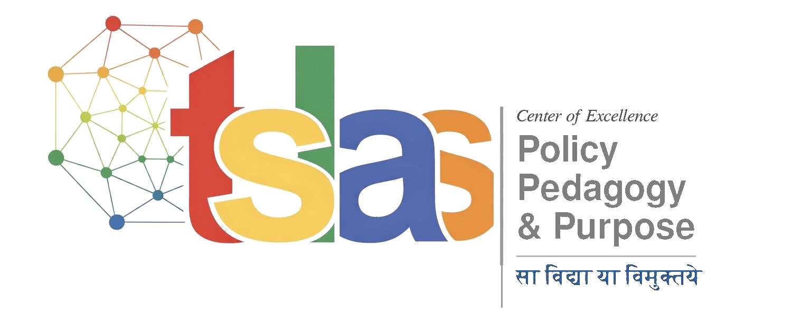

# Centre of Excellence in Policy, Pedagogy & Purpose — Website

> *Impact through innovation.*
>
> A flagship Centre of the Thapar School of Liberal Arts & Sciences (TSLAS), Patiala.

A static website for the **PPP Centre of Excellence** — built as a single, self-contained, light-theme site with editorial typography, a refined liberal-arts aesthetic, and zero build step. Drop it on GitHub Pages and you're live.

## Stack

- **HTML5** (`index.html`) — semantic, single-page
- **CSS3** (`styles.css`) — custom properties, no framework, no preprocessor
- **Vanilla JS** (`script.js`) — sticky nav, mobile menu, scroll reveals
- **Type**: [Fraunces](https://fonts.google.com/specimen/Fraunces) (display) + [Manrope](https://fonts.google.com/specimen/Manrope) (body), both via Google Fonts
- **No build tools.** No npm. No bundler. Just three files.

## File structure

```
.
├── index.html          # The page (all content lives here)
├── styles.css          # All styles
├── script.js           # Sticky nav, reveal animations, smooth scroll
├── assets/
│   └── logo.png        # PPP / TSLAS logo
└── README.md
```

## Run locally

Any static server will do. The simplest:

```bash
python3 -m http.server 8000
# then open http://localhost:8000
```

Or just open `index.html` directly in a browser — everything works without a server.

## Deploy to GitHub Pages

1. Create a new repository on GitHub (e.g. `ppp-centre`).
2. Push these files to the `main` branch.
3. In the repo, go to **Settings → Pages**.
4. Under **Source**, select **Deploy from a branch**, choose `main` and `/ (root)`.
5. Save. Your site will be live at `https://<username>.github.io/<repo>/` within a minute.

For a custom domain (e.g. `ppp.tsl.edu`), add a `CNAME` file with your domain name and configure DNS records as documented in [GitHub's custom domain guide](https://docs.github.com/en/pages/configuring-a-custom-domain-for-your-github-pages-site).

## Editing content

All page content lives in `index.html`, organised by section:

| Section          | Anchor          | Where to edit                          |
| ---------------- | --------------- | -------------------------------------- |
| Hero             | top of page     | `<section class="hero">`               |
| Federal model    | `#about`        | `<section class="section--about">`     |
| Eight themes     | `#themes`       | each `<article class="theme">`         |
| Initiatives      | `#initiatives`  | each `<div class="init">`              |
| Sub-units        | `#sub-units`    | `<article class="unit">` (ACT, IKS)    |
| DISHA connection | (no anchor)     | `<section class="section--disha">`     |
| Roadmap          | `#roadmap`      | each `<li class="phase">`              |
| Team             | `#team`         | `.founder` + each `<a class="member">` |
| Footer           | `#contact`      | `<footer class="footer">`              |

### Adding real photos to the Team section

The Team section (§ 07) ships with elegant initials-based avatars as a placeholder. To replace any one of them with a real photo, do this in two steps:

**1. Save the photo.** Drop a square photo (ideally 400×400px or larger) into the `assets/team/` folder. Name the file using lowercase with hyphens — e.g. `padmakumar-nair.jpg`, `kazuma-mizukoshi.jpg`, `rahul-upadhyay.jpg`.

You'll need to create the `team` subfolder inside `assets/` the first time you do this. On GitHub: navigate to `assets/`, click **Add file → Create new file**, type `team/.gitkeep` as the filename, commit. Then upload photos there.

**2. Edit `index.html`.** Find the team member's `<div class="member__avatar">` (or `<div class="founder__avatar">` for the founder) and replace the `<span class="member__initials">…</span>` with an `` tag.

**Before:**
```html
<div class="member__avatar">
  <span class="member__initials">KM</span>
</div>
```

**After:**
```html
<div class="member__avatar">
  
</div>
```

That's the entire change. The CSS already handles cropping the photo into the circle — you don't need to touch any styles.

You can mix and match: replace some with photos, leave others as initials. They'll look consistent.

If you ever want to revert to initials, just put the `<span class="member__initials">XX</span>` back. The two are interchangeable.

### Adding a new theme

```html
<article class="theme" style="--accent:#YOURHEX">
  <header class="theme__head">
    <span class="theme__num">09</span>
    <span class="theme__tag">Tag</span>
  </header>
  <h3 class="theme__title">Theme Title</h3>
  <p class="theme__body">Description...</p>
  <p class="theme__q">
    <span class="theme__q-mark">?</span>
    Key research question or anchor.
  </p>
</article>
```

The `--accent` CSS variable controls the theme's signature colour (number, top border on hover, question mark). Pick from the existing palette in `styles.css` (`--c-red`, `--c-gold`, etc.) or set a custom hex.

### Changing colours

Brand colours are defined as CSS custom properties at the top of `styles.css` under `:root`. The full palette is drawn from the logo:

```css
--c-red:     #C73E1D;   /* the red 't' */
--c-gold:    #C99A2E;   /* the yellow 's' */
--c-blue:    #3A6FB0;   /* the blue 'a' */
--c-green:   #4A7C3F;   /* the green accent */
--c-orange:  #D87A2A;   /* the orange 's' */
--c-maroon:  #9B2D2A;
--c-saffron: #E07A2A;
--c-slate:   #5B6F8E;
```

The dominant page surface is a warm parchment (`#FAF7F1`); the dark accents (footer, DISHA panel) use a warm near-black (`#1F1B16`).

### Replacing the logo

Replace `assets/logo.png` with your file. If you change the filename or extension, update the two references in `index.html`:

```html
<link rel="icon" type="image/png" href="assets/logo.png">
...

```

## Design notes

- **Editorial, not corporate.** Display type uses [Fraunces](https://fonts.google.com/specimen/Fraunces) at large optical sizes with subtle softness — the goal is "literary journal" rather than "tech startup."
- **Federal architecture as visual metaphor.** The themes section uses a strict 4-column grid with hairline borders to convey the *one Centre, many themes* model; each card carries a single coloured accent that activates on hover.
- **Sanskrit motto as a recurring motif.** सा विद्या या विमुक्तये appears in the hero and footer, anchoring the site's India-centred identity.
- **Restraint.** Colour is used sparingly. Most of the page is ink-on-parchment; accents earn their attention.
- **Light theme only.** No dark-mode toggle by design — the editorial palette doesn't have a meaningful dark counterpart.

## Accessibility

- Semantic HTML (`<header>`, `<nav>`, `<main>`, `<section>`, `<article>`, `<footer>`).
- Keyboard-navigable mobile menu with `aria-expanded`.
- Respects `prefers-reduced-motion` (disables scroll reveals).
- Sufficient colour contrast on body text (≥ 7:1).
- All interactive elements are `<a>` or `<button>`, never bare divs.

## Browser support

Modern evergreen browsers (Chrome, Firefox, Safari, Edge — last two major versions). Uses `IntersectionObserver`, `backdrop-filter`, and CSS custom properties — all widely supported as of 2025.

## License

The code in this repository is released for use by TSLAS. Content (text, logo, motto) belongs to the Centre of Excellence in Policy, Pedagogy & Purpose, TSLAS, TIET Patiala.

---

*Built for the Centre of Excellence in Policy, Pedagogy & Purpose · TSLAS · TIET Patiala*
